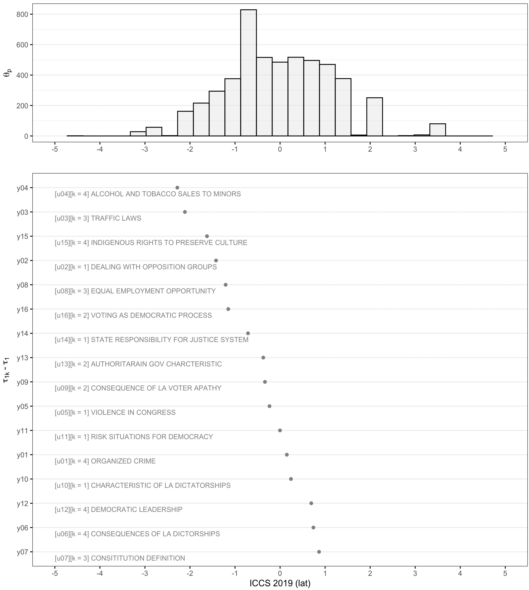

---

# Introducción

- En este reporte vamos a ajustar un modelo Rasch, sobre los items `LS2T01-LS2T16` del modulo latinoamericano.

- Vamos a emplear a la librería TAM para estos propósitos

- Los datos que vamos a emplear, se pueden bajar en el siguiente link:

https://www.dropbox.com/scl/fo/rdud812cj7tdy5iw9oklp/h?rlkey=uvn3vspgvpgmuvzobx1ezao5v&dl=0

- En este link, se encuentran los datos de todos los paises que participaron en ICCS 2009. Esto incluye respectivamente a:
  + Chile
  + Colombia
  + Republica Dominicana
  + Guatemala
  + Mexico
  + Paraguay

- Los archivos de nombre `ISL` corresponden al modulo latinoamericano, y los archivos que comienzan con `ISG`, corresponden al cuestionario internacional, que ademas incluye a los puntajes del test internacional.

- Los archivos de cada país son los siguientes:

```

# Chile
ISLCHLC2.sav
ISGCHLC2.sav

# Colombia
ISLCOLC2.sav
ISGCOLC2.sav

# Republica Dominicana
ISLDOMC2.sav
ISGDOMC2.sav

# Guatemala
ISLGTMC2.sav
ISGGTMC2.sav

# Mexico
ISLMEXC2.sav
ISGMEXC2.sav

# Paraguay
ISLPRYC2.sav
ISGPRYC2.sav

```

- En clases, vimos brevemente como se ordenan las locaciones de los items en el caso de Chile.

```{r echo = FALSE, out.width = '100%', fig.retina = 1}

```

- En esta plantilla, se incluyen sugerencias de que códigos emplear en algunos pasos, para facilitar el desarollo de este reporte.

- Los códigos de ejemplos que pueden ser empleados en este reporte, se encuentran disponibles en: https://github.com/dacarras/edu4050_2024_example_2


# Instrucciones

* Recuerde... 
     - no alterar el formato de este documento y responder en los espacios asignados
     - descargar la base de datos y subirla a la nube de este proyecto, o a la carpeta en la que tenga a este código.

¡Éxito!


---

# Ejercicio 1

- Instale las librerías que se requieren para este reporte.

```{r, echo = TRUE, eval = FALSE}


# collection of libraries to handle data
install.packages('tidyverse')

# library to install libraries from github
install.packages('devtools')

# library with functions to work with ILSA data
devtools::install_github('dacarras/ilsa',force = TRUE)

# library to generate survey estimates
install.packages('survey')

# library to generate survey estimates
install.packages('srvyr')

# library to get estimates with plausible values
install.packages('mitools')

```

# Ejercicio 2

- Cargue en sesión todos los datos de los modulos latinoamericanos de cada pais.

```

# Colombia
ISLCOLC2.sav
ISGCOLC2.sav

# Republica Dominicana
ISLDOMC2.sav
ISGDOMC2.sav

# Guatemala
ISLGTMC2.sav
ISGGTMC2.sav

# Mexico
ISLMEXC2.sav
ISGMEXC2.sav

# Paraguay
ISLPRYC2.sav
ISGPRYC2.sav

```

# Ejercicio 3

- Recodifique las respuestas de los items del test. En la siguiente tabla se incluye las claves de respuestas correctas de cada item, en `[k = *]`, sobre cada una de las bases de datos.

```{r}

item_text <- read.table(text = "
item      item_text
LS2T01    '[k = 4] ORGANIZED CRIME                        '
LS2T02    '[k = 1] DEALING WITH OPPOSITION GROUPS         '
LS2T03    '[k = 3] TRAFFIC LAWS                           '
LS2T04    '[k = 4] ALCOHOL AND TOBACCO SALES TO MINORS    '
LS2T05    '[k = 1] VIOLENCE IN CONGRESS                   '
LS2T06    '[k = 4] CONSEQUENCES OF LA DICTORSHIPS         '
LS2T07    '[k = 3] CONSITITUTION DEFINITION               '
LS2T08    '[k = 3] EQUAL EMPLOYMENT OPPORTUNITY           '
LS2T09    '[k = 2] CONSEQUENCE OF LA VOTER APATHY         '
LS2T10    '[k = 1] CHARACTERISTIC OF LA DICTATORSHIPS     '
LS2T11    '[k = 1] RISK SITUATIONS FOR DEMOCRACY          '
LS2T12    '[k = 4] DEMOCRATIC LEADERSHIP                  '
LS2T13    '[k = 2] AUTHORITARAIN GOV CHARCTERISTIC        '
LS2T14    '[k = 1] STATE RESPONSIBILITY FOR JUSTICE SYSTEM'
LS2T15    '[k = 4] INDIGENOUS RIGHTS TO PRESERVE CULTURE  '
LS2T16    '[k = 2] VOTING AS DEMOCRATIC PROCESS           '
", header = TRUE)

knitr::kable(item_text)

```


```{r}

# utilice la funcion dplyr::if_else; o case_when, para recodificar las variables de respuesta.
# revise el archvio, `edu4050_e04_m02_fit_rasch_model.qmd` en las lineas 245 y 260 para seguir un ejemplo.


```


# Ejercicio 4

- Ajuste un modelo Rasch sobre los 16 items del test, sobre cada país por separado.

```{r}

# emplee la función TAM::tam.mml(), para ajustar un modelo rasch con MML
# revise el archvio, `edu4050_e04_m02_fit_rasch_model.qmd` en las lineas 577 a 610 para seguir un ejemplo.

```


# Ejercicio 5

- Extraiga los puntajes IRT de tipo WLE, empleando a la functión `TAM::tam.wle()`, y calcule la media obtenida de los puntajes generados, para cada país

```{r}

# revise el archvio, `edu4050_e04_m02_fit_rasch_model.qmd` en las lineas 628 a 631 para seguir un ejemplo.


```

# Ejercicio 6

- Indique si las medias son similares, y luego explique, con sus propias palabras porque se encuentra este resultado.

- **Respuesta**
  + `indique su respuesta en estas líneas`.


# Ejercicio 7

- Obtenga una tabla de los delta estimados de cada país.
- Compare los deltas mediante correlación y/o restas.
- Y considerando los resultados obtenidos en cada caso, responda la siguientes preguntas


```{r}

# incluya su codigo aqui.


```

- ¿Qué tan similares son los deltas obtenidos?. ¿Son iguales entre países?
  + `indique su respuesta en estas líneas`.

# Ejercicio 8

- Una todas las bases de datos todos los paises, empleando `dplyr::bind_rows()`. Luego, ajuste el modelo Rasch, sobre esta nueva base de datos. Calcule la media obtenida de puntajes IRT de tipo WLE. Luego, conteste la pregunta que se indica:

```{r}

# incluya su codigo aqui.


```

- ¿Por que la media obtenida se parece a la de los ejercios anteriores?
  + `indique su respuesta en estas líneas`.

